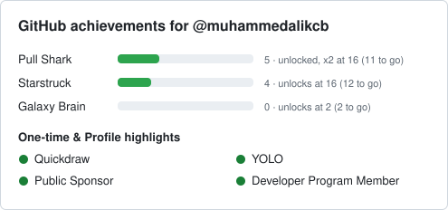

# Muhammed Ali Kocabey

**Senior Android Engineer | Kotlin, Jetpack Compose, Coroutines, Flow | Clean Architecture | Fintech and core banking**

Senior Android engineer with 5+ years building secure Android apps, most recently in fintech and core banking. At Akbank I work on the core-banking Android app: security and account-access modules, shared UI components, and the migration from RxJava to Coroutines and Flow. I designed and shipped the bank's in-house NFC identity-verification SDK, which replaced a third-party vendor and is now in production. Outside work I maintain open-source security and architecture tooling for Kotlin and Android.

I care about hard problems and code that has to be correct, because real money and real identities depend on it. I build in the open, which is why Aspectify and SecureCheck are public.

## What I Work On

- Core-banking Android at Akbank: security and account-access modules, including login and channel restrictions, trusted-device authorization, daily-limit and international-usage rules, SIM-change blocking, and the authentication flow.
- Shared UI components and the RxJava to Coroutines and Flow migration, from proof of concept to a standard across feature modules.
- Custom internal declarative UI framework at Akbank; Jetpack Compose in personal and open-source projects.

## Open Source

**[Aspectify](https://github.com/muhammedalikcb/aspectify)** &nbsp;   
Annotation-based AOP framework for Kotlin and Android, built on Kotlin Reflection and Dynamic Proxy. Adds retry, logging, and timeout around annotated calls with minimal boilerplate.

**[SecureCheck](https://github.com/muhammedalikcb/securecheck)** &nbsp;  
Mobile security reference app with 25+ runtime and system-integrity checks (root, SSL pinning, Frida/Xposed, SafetyNet, emulator, debugger). Clean Architecture, Dagger 2, Compose, MotionLayout.

**[gh-achievements](https://github.com/muhammedalikcb/gh-achievements)** &nbsp;   
Kotlin CLI and GitHub Action that show how close you are to your next GitHub achievement tier, in English and Turkish. The card below is generated by it and refreshed every morning.

More samples on my profile: Mealz (Compose) and Exzi (crypto trading UI).

## Selected Professional Work

*Closed-source enterprise and client apps.*

- **Akbank, via Veripark (2023 to present):** core-banking Android; security and account-access modules; in-house identity-verification SDK; RxJava to Coroutines and Flow migration.
- **Altamira Digital (2022 to 2023):** sole Android developer for 8 published resident-services and loyalty apps (TAV Passport, Zorlu World, Buyukyali, Aliving, and others); MasterPass 3D-Secure payments, signed rotating-QR tokens, WebRTC concierge calls, offline-first paging.
- **Comodo / Xcitium (2021 to 2022):** sole Android developer (Java) and iOS developer (Objective-C) on mobile security; also built an internal support-ticketing CRM (Laravel + MySQL).
- **ScoreUpp (2019 to 2021):** founder; NLP and BERT-based review analytics.

## Tech Stack

**Languages:** Kotlin, Java.
**Architecture:** Clean Architecture, MVVM, MVI, multi-module.
**Async and data:** Coroutines, Flow, Room, Retrofit, OkHttp.
**DI and build:** Hilt, Dagger 2, KSP, Gradle.
**UI:** Jetpack Compose (personal and open-source); custom internal declarative framework at Akbank.
**Platform and security:** NFC, encrypted session management, Keystore, SSL pinning, Play Integrity, mobile integrity checks.
**Testing:** JUnit, MockK.

## Writing and Speaking

Medium ([medium.com/@muhammedalikocabey](https://medium.com/@muhammedalikocabey)), in Turkish and English; podcast "[Shaping the Future of Android](https://open.spotify.com/show/7waAQAWmr2WIQNTlTJkkos)" on Spotify.

## Certifications and Education

PSD I, PSM I (Scrum.org); Secure Coding Training (Akbank internal); Deep Learning Specialization (DeepLearning.AI, 2020); BSc Computer Engineering, Konya Technical University (2016 to 2021), MSc in progress.
